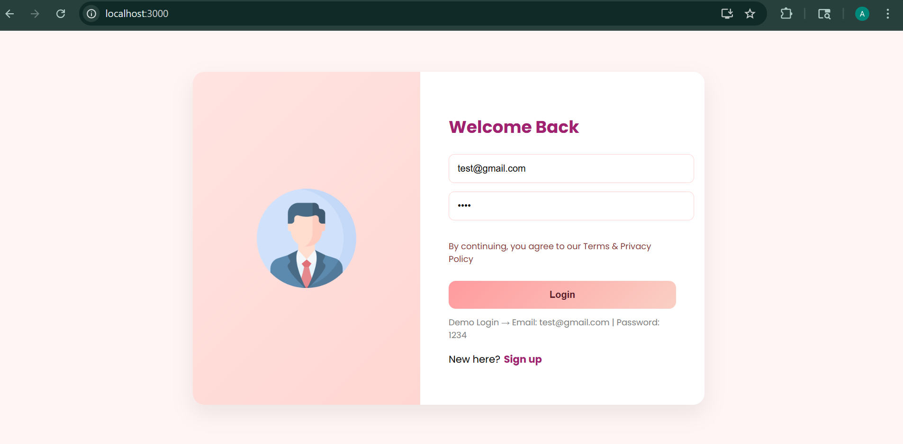
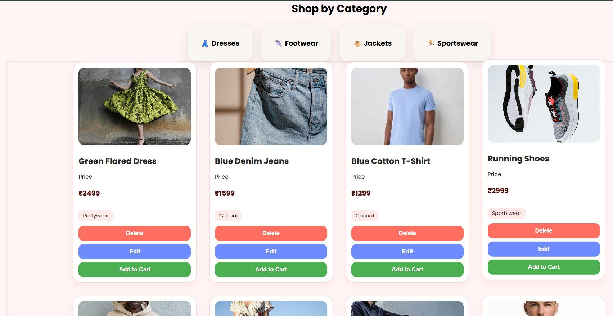
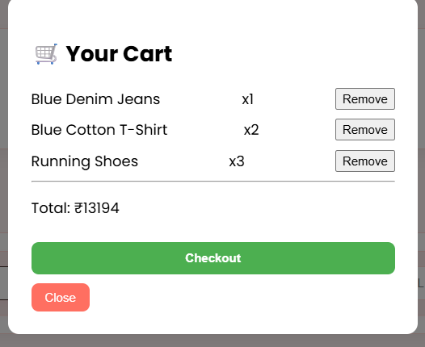
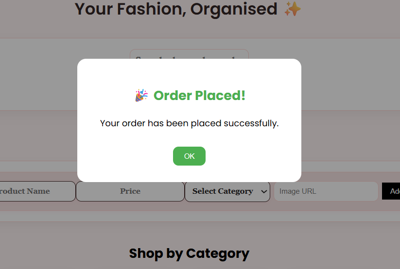

# 🛍️ Navella E-Commerce Web Application

## 👤 Author

**Akshita Arya**  
Roll No: 2305513  
KIIT University  
Full Stack Java Project  

---

## 📌 Project Overview

Navella is a full-stack e-commerce web application developed using **Spring Boot (Java)** for the backend and **React.js** for the frontend.

The application allows users to browse products, filter and search items, manage a shopping cart, and simulate an online shopping experience with dynamic UI interactions.

This project combines both admin and user functionalities in a single interface. In real-world applications,these roles are typically separated where admin manages products and users perform purchases.

---

## 🔄 System Flow

```
User → React UI → API → Spring Boot → Database → Response → UI
```

## 🚀 Tech Stack

### 🔹 Frontend

- React.js  
- HTML, CSS, JavaScript  
- Axios  

### 🔹 Backend

- Java (Spring Boot)  
- REST APIs  
- JPA / Hibernate  
- Maven  

### 🔹 Database

- MySQL  

---

## ✨ Features

- 🛍️ View all products  
- 🔍 Search products by name  
- 🎯 Filter by category  
- 📊 Sort products by price  
- 🛒 Add to cart  
- ➕ Increase / decrease quantity  
- ❌ Remove items from cart  
- 🧾 Cart popup with total calculation  
- ✅ Checkout with confirmation dialog  
- 🎨 Interactive UI with hover effects  

---

## ⚙️ Setup Instructions

### 🔹 Backend Setup

```bash
cd backend
mvn clean install
mvn spring-boot:run
```

Backend runs on:

```
http://localhost:8080
```

---

### 🔹 Frontend Setup

```bash
cd frontend_navella
npm install
npm start
```

Frontend runs on:

```
http://localhost:3000
```

---

## 🔗 API Endpoints

| Endpoint | Description |
|--------|------------|
| `/products` | Get all products |
| `/products/filter` | Filter by category |
| `/products/search` | Search by name |
| `/products/sort` | Sort by price |
| `/products/{id}` | Update/Delete product |

---

## 📂 Project Structure

```
navella-ecommerce/
│
├── backend/
│   ├── src/
│   ├── pom.xml
│
├── frontend_navella/
│   ├── src/
│   ├── public/
│   ├── package.json
│
├── screenshots/
│
└── README.md
```

---

## 📸 Screenshots

### 🏠 Login Page


### 🔍 Product Listing


### 🛒 Cart Popup


### ✅ Checkout Success


---

## ⚠️ Notes

- Project uses REST APIs for frontend-backend communication  
- MySQL database is used for persistent storage  
- Cart functionality is handled using React state

---

## 📈 Future Improvements

- Payment gateway integration  
- User authentication (JWT)  
- Order history system  
- Admin dashboard  
- Better UI/UX enhancements  

---

## 🎯 Conclusion

This project demonstrates a complete full-stack application integrating frontend, backend, and database systems.  
It highlights real-world implementation of e-commerce functionalities and user interaction handling.
